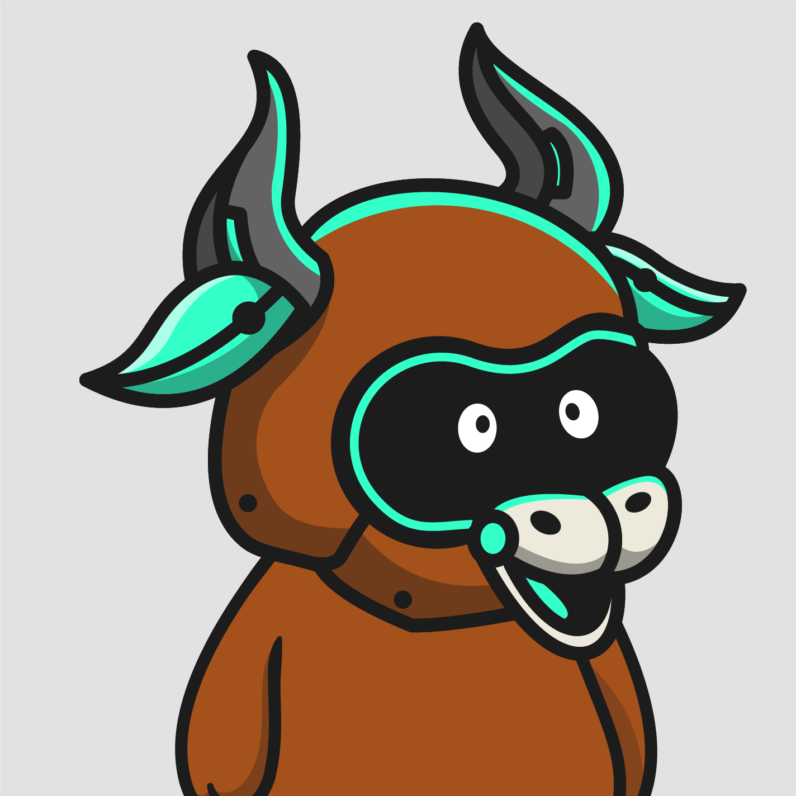

# Chainlink Dynamic NFT contracts

This project mints Dynamic NFTs that change based on the market price of an asset pair (for example, the BTC/USD asset price). When prices go up, its a bull trend and when the go down its a bear trend. We run [Chainlink Automation](https://docs.chain.link/chainlink-automation) to have our smart contract automatically called at specified intervals so that on-chain logic checks the [Chainlink Price Feed](https://docs.chain.link/data-feeds/price-feeds) to see if there has been a change in price. Accordingly the minted NFTs dynamically alternate between the images below.

    
    
    
    
    
    

